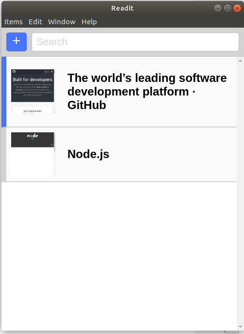
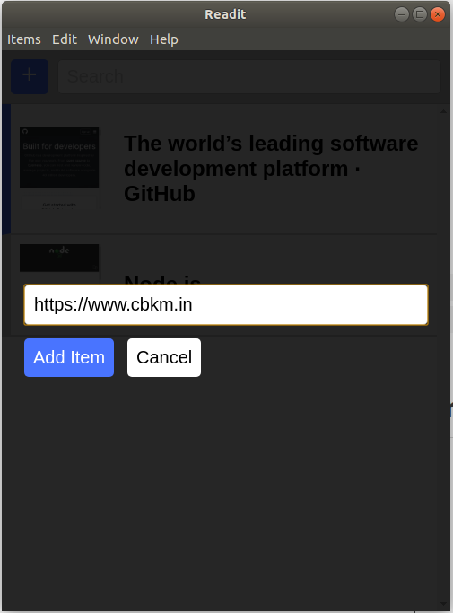
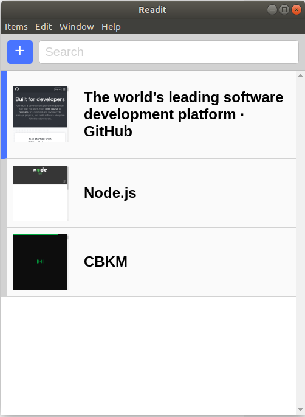
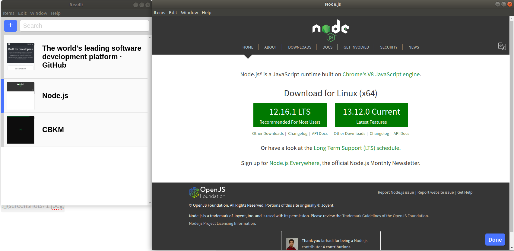

# Book Mark Desktop App

### This is an Desktop electron app where :-
- We can add our website 
- Can read the added website 
- Mark as done 
- With various shortcuts 
- And real-time screenshot of the website
- Search the Title with keyword

### For Developer
`npm install`
`npm run watch` 

## Screenshots

## Links
- [https://github.com/stackacademytv/master-electron](https://github.com/stackacademytv/master-electron)
- [https://www.electronjs.org/](https://www.electronjs.org/)

 
